# 🍽️ DineMateApp

**An AI-powered group dining recommendation platform that learns from conversations to suggest perfect restaurants for groups.**

## 🏗️ Architecture diagram

## BackendAcrhitecture

```mermaid
graph TB
    %% External Systems
    Client[Mobile/Web Client]
    FourSquare[Foursquare Places API]
    Firebase[Firebase Auth]
    Redis[(Redis Cache/Queue)]
    
    %% Main Application Components
    subgraph "FastAPI Backend"
        API[API Gateway<br/>FastAPI Router]
        
        subgraph "API Endpoints"
            AuthAPI[Auth API<br/>/api/v1/auth]
            GroupAPI[Groups API<br/>/api/v1/group]
            UserAPI[Users API<br/>/api/v1/user]
            RestAPI[Restaurants API<br/>/api/v1/restaurants]
            PrefAPI[Group Preferences API<br/>/api/v1/group-preferences]
        end
        
        subgraph "Business Logic Services"
            AuthSvc[Auth Service]
            UserSvc[User Service]
            GroupSvc[Group Service]
            RestSvc[Restaurant Service]
            PrefSvc[Group Preference Service]
            RecEngine[Recommendation Engine]
            FourSvc[Foursquare Service]
        end
        
        subgraph "Data Models"
            UserModel[User Model]
            GroupModel[Group Model]
            RestModel[Restaurant Model]
            PrefModel[Group Preferences Model]
        end
    end
    
    %% Background Processing
    subgraph "Background Processing"
        Celery[Celery Worker]
        
        subgraph "Task Types"
            MsgAnalysis[Message Analysis Tasks]
            DataSync[Data Sync Tasks]
            Maintenance[Maintenance Tasks]
        end
    end
    
    %% AI/ML Services
    subgraph "AI/LLM Services"
        LangGraph[LangGraph Analyzer]
        OpenAI[OpenAI GPT-4]
        
        subgraph "AI Tools"
            ParamExtractor[Foursquare Parameter Extractor]
            SentimentAnalyzer[Sentiment Analyzer]
            RestaurantDetector[Restaurant Mention Detector]
        end
    end
    
    %% Database
    MongoDB[(MongoDB Database)]
    
    %% Connections - External
    Client -->|HTTPS/REST| API
    Firebase -->|Token Validation| AuthSvc
    FourSquare -->|Restaurant Data| FourSvc
    
    %% Connections - API Layer
    API --> AuthAPI
    API --> GroupAPI
    API --> UserAPI
    API --> RestAPI
    API --> PrefAPI
    
    %% Connections - Service Layer
    AuthAPI --> AuthSvc
    GroupAPI --> GroupSvc
    UserAPI --> UserSvc
    RestAPI --> RestSvc
    PrefAPI --> PrefSvc
    
    %% Connections - Cross-Service Dependencies
    GroupSvc --> UserSvc
    PrefSvc --> GroupSvc
    RecEngine --> PrefSvc
    RecEngine --> RestSvc
    RestSvc --> FourSvc
    
    %% Connections - Data Layer
    AuthSvc --> UserModel
    UserSvc --> UserModel
    GroupSvc --> GroupModel
    RestSvc --> RestModel
    PrefSvc --> PrefModel
    
    UserModel --> MongoDB
    GroupModel --> MongoDB
    RestModel --> MongoDB
    PrefModel --> MongoDB
    
    %% Connections - Background Processing
    Celery --> Redis
    Celery --> MongoDB
    Celery --> MsgAnalysis
    Celery --> DataSync
    Celery --> Maintenance
    
    %% Connections - AI/LLM
    MsgAnalysis --> LangGraph
    LangGraph --> OpenAI
    LangGraph --> ParamExtractor
    LangGraph --> SentimentAnalyzer
    LangGraph --> RestaurantDetector
    
    %% Background task triggers
    GroupAPI -.->|New Messages| MsgAnalysis
    DataSync -.->|Scheduled| FourSvc
    
    %% Styling
    classDef external fill:#bbdefb,stroke:#1565c0,stroke-width:2px,color:#000
    classDef api fill:#e1bee7,stroke:#7b1fa2,stroke-width:2px,color:#000
    classDef service fill:#c8e6c9,stroke:#2e7d32,stroke-width:2px,color:#000
    classDef model fill:#ffe0b2,stroke:#f57c00,stroke-width:2px,color:#000
    classDef background fill:#f8bbd9,stroke:#c2185b,stroke-width:2px,color:#000
    classDef ai fill:#dcedc1,stroke:#689f38,stroke-width:2px,color:#000
    classDef database fill:#b2dfdb,stroke:#00695c,stroke-width:2px,color:#000
    
    class Client,FourSquare,Firebase,Redis external
    class API,AuthAPI,GroupAPI,UserAPI,RestAPI,PrefAPI api
    class AuthSvc,UserSvc,GroupSvc,RestSvc,PrefSvc,RecEngine,FourSvc service
    class UserModel,GroupModel,RestModel,PrefModel model
    class Celery,MsgAnalysis,DataSync,Maintenance background
    class LangGraph,OpenAI,ParamExtractor,SentimentAnalyzer,RestaurantDetector ai
    class MongoDB database
```

